## Easy Level Machines

[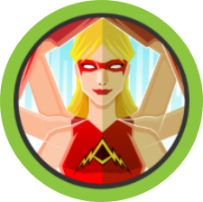](Active/)

[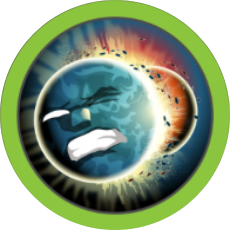](Armageddon/)
[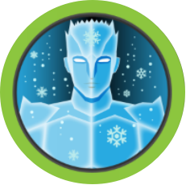](Artic/)
[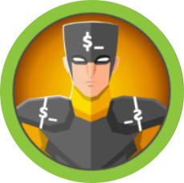](Bashed/)
[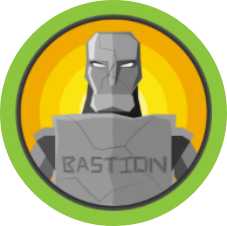](Bastion/)
[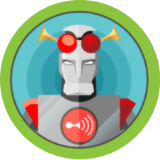](Beep/)
[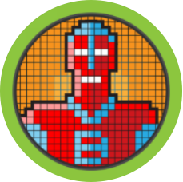](Blocky/)

[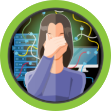](Blunder/)
[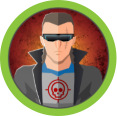](Bounty/)
[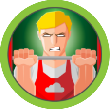](Buff/)
[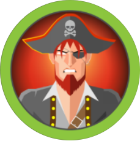](Cap/)
[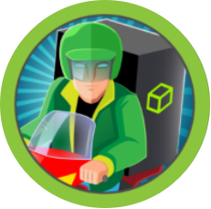](Delivery/)
[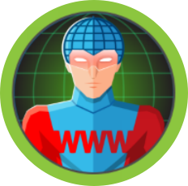](Devel/)

[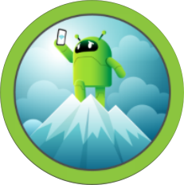](Explore/)
[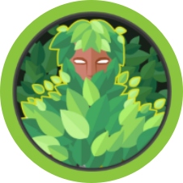](Forest/)
[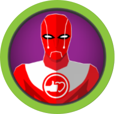](Friendzone/)
[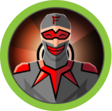](Frolic/)
[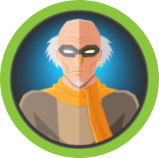](Grandpa/)

[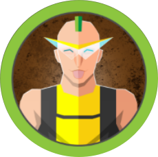](Irked/)
[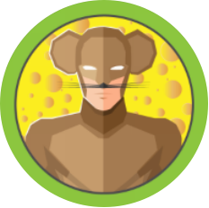](Jerry/)
[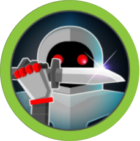](Knife/)
[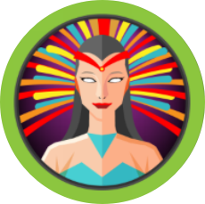](Lame/)
[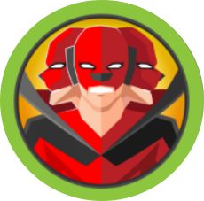](Legacy/)
[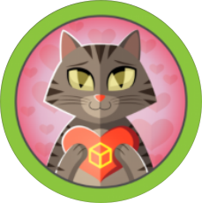](Love/)

[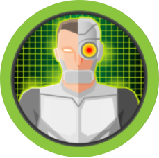](Mirai/)

[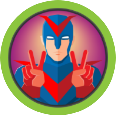](Optimum/)

[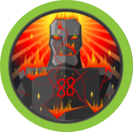](Sauna/)
[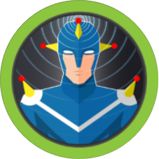](Sense/)
[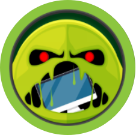](ServMon/)
[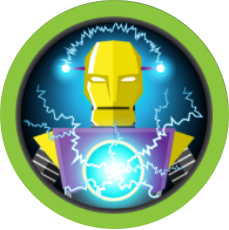](Shocker/)
[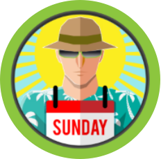](Sunday/)

[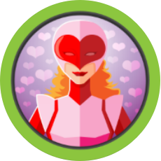](Valentine/)
